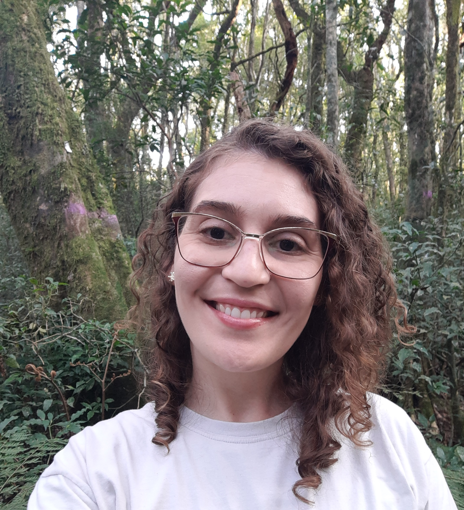

```{r, include=FALSE}
knitr::opts_chunk$set(
  results='asis', 
  echo = FALSE
)

library(glue)
library(tidyverse)
library(dplyr)

# Set this to true to have links turned into footnotes at the end of the document
PDF_EXPORT <- TRUE

# Holds all the links that are inserted for placement at the end
#links <- c()

source('parsing_functions.R') # Functions for building sections from CSV data
source('common_variables.R')  # Small variables for non-csv data such as intro text

# Load csv with position info
position_data <- read.csv('positions.csv', sep = ";")
```

```{r}
# When in export mode the little dots are unaligned, so fix that. 
if(PDF_EXPORT){
  cat("
  <style>
  :root{
    --decorator-outer-offset-left: -6.5px;
  }
  </style>")
}
```

# Aside

{width="100"}

```{r eval=FALSE, echo=FALSE}
# When in export mode the little dots are unaligned, so fix that. 
if(PDF_EXPORT){
  cat("View this CV online with links at https://kmbordin.github.io/CV/")
} else {
  cat("[<i class='fas fa-download'></i> Download a PDF of this CV](https://github.com/nstrayer/cv/raw/master/strayer_cv.pdf)")
}
```

## Contact {#contact}

<i class="fa fa-envelope"></i> [kauanembordin\@gmail.com](mailto:kauanembordin@gmail.com){.email}

<i class="fa fa-twitter"></i> kmbordin

<i class="fa fa-github"></i> github.com/kmbordin

<i class="fa fa-link"></i> [https://kmbordin.github.io](https://kmbordin.github.io/)

## Language Skills {#skills}

```{r}
print_skill_bars(skills)
```

## Disclaimer {#disclaimer}

Made with the R package [**pagedown**](https://github.com/rstudio/pagedown).

The source code is available at [github.com/nstrayer/cv](https://github.com/nstrayer/cv).

Last updated on `r Sys.Date()`.

# Main

## Kauane Maiara Bordin {#title}

```{r}
cat(sanitize_links(intro_text))
```

## Education {data-icon="graduation-cap" data-concise="true"}

```{r}
print_section(position_data, 'education')
```

## Research Experience {data-icon="laptop"}

```{r}
print_section(position_data, 'research_positions')
```

## Teaching Experience {data-icon="chalkboard-teacher"}

`{#{r} #print_section(position_data, 'teaching_positions')`

## Prizes and grants {data-icon="newspaper"}

`{# {r} # print_section(position_data, 'prizes_grants')`

## Selected Publications - Peer-reviewed {data-icon="book"}

`{# {r} # print_section(position_data, 'academic_articles')`

## Selected Publications - Preprints {data-icon="book"}

`{# {r} # print_section(position_data, 'preprint_article')`

## Technical production {data-icon="laptop"}

`{# {r} # print_section(position_data, 'technical_production')`

## Professional academic service {data-icon="newspaper"}

`{# {r} # print_section(position_data, 'professional_rev')`

## Talks {data-icon="chalkboard-teacher"}

`{# {r} # print_section(position_data, 'talks_academic')`

## Selected Publications - Preprints {data-icon="book"}

{# {r} \# print_section(position_data, 'preprint_article')CV comming soon
