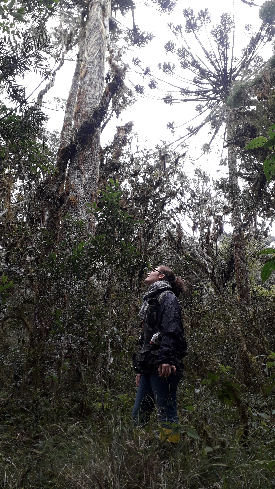

I am a Brazilian researcher currently based in the [Federal University of Rio Grande do Sul](http://www.ufrgs.br/ufrgs/inicial)

{width="285"} {width="298"}

### Experience

Hello! I am Kauane Maiara Bordin, an ecologist with a passion for uncovering the structure and dynamics of forest ecosystems. I hold a Ph.D. in [Ecology](https://www.ufrgs.br/ppgecologia/) from the Federal University of Rio Grande do Sul ([UFRGS](http://www.ufrgs.br/ufrgs/inicial)), where I also completed my Master\'s degree. My journey into the natural world began with a Bachelor\'s in Biological Sciences from Universidade Comunitária da Região de Chapecó, both institutions rooted in the Brazilian Atlantic Forest in Southern Brazil, a region known for its rich biodiversity.

Currently, I am a research fellow at UFRGS\'s Department of Ecology. My expertise spans Community Ecology, Functional Ecology, and Quantitative Ecology, with a strong focus on analyzing complex ecological data using R programming.

My research centers on the long-term monitoring of forest ecosystems to understand their response to climate change. By studying the demographic dynamics of tree species and their functional traits, I aim to uncover patterns that drive forest resilience and carbon storage potential. This work is critical for predicting how forests will adapt to global changes and informing strategies for their conservation and sustainable management.

 in Southern Brazil ](assets/images/promata.jpg){alt="Pró-Mata protected area in Southern Brazil" width="527"}

{width="529"}
